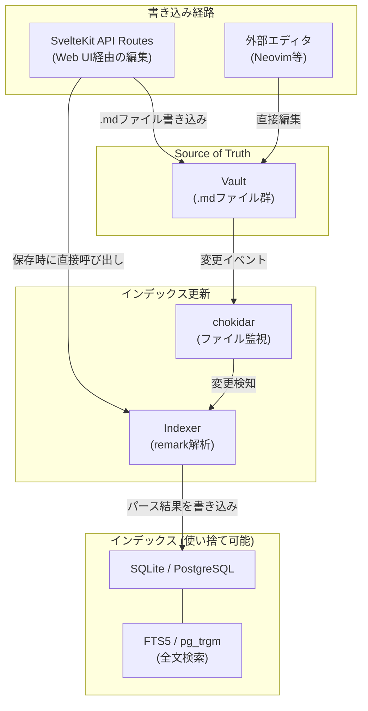
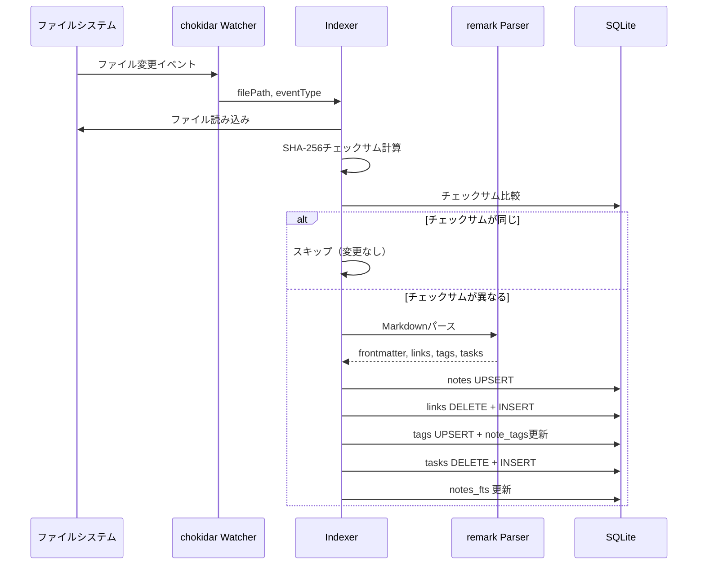

# ADR-002: ハイブリッドストレージモデルの採用

## 背景・課題 (Background/Problem)
- Prometheusの根幹要件として「Markdownファイル（.md）でノートを管理する」がある
- 一方で、全文検索、双方向リンク解決、タグフィルタリング、タスク集約といった機能にはインデックスが必要
- ファイルシステムだけでは検索が遅く（毎回全ファイルをパースする必要がある）、DBだけではNeovim等の外部エディタとの併用ができない
- .mdファイルのポータビリティ（他のMarkdownツールへの移行容易性）を維持したい
- 外部エディタ（Neovim等）でファイルを直接編集した場合にも、Web UIに即座に反映される必要がある

## 決定事項 (Decision)
- **.mdファイルを唯一の真実（Single Source of Truth）** とする
- **DBはインデックス（使い捨て可能なキャッシュ）** として利用する。DBを削除しても.mdファイルから再構築できる
- ファイル変更時（Web UI経由・外部エディタ経由の両方）にIndexerが.mdファイルをパースし、メタデータをDBに書き込む
- 外部エディタの変更検知にはchokidarを使用する

### データフロー



### .mdファイルフォーマット

```yaml
---
id: "01HX4..."           # ULID (ソート可能・一意)
title: "ノートタイトル"
created: 2026-04-02T09:00:00Z
modified: 2026-04-02T14:30:00Z
tags: [tag1, tag2]
theme: ocean              # オプショナル: ノート個別テーマ
---
```

- フロントマターにメタデータを記述。YAML形式でgray-matterライブラリで解析
- IDにはULIDを採用。UUIDと異なりソート可能で、作成順の並び替えが自然にできる
- `[[wikilink]]` 構文でノート間リンクを表現。slugベースで解決（ファイル名の拡張子なし、大文字小文字非区別）
- `- [ ]` / `- [x]` 構文でタスクを表現。Indexerがline_numberと共にtasksテーブルへ抽出

### Indexerの処理フロー



### 理由 (Reasons)
- **.mdファイルの普遍性**: Obsidian、Typora、VS Code、Neovim — あらゆるツールで読み書きできる。ベンダーロックインがゼロ
- **外部エディタとの完全な互換性**: Neovimで編集→chokidarが検知→Web UIに即反映。双方向の同期が自然に実現
- **DBの再構築可能性**: DBが破損してもゼロコストで復旧。`bun run db:reindex` で全ファイルからインデックスを再構築
- **Git管理の容易さ**: .mdファイルをGitで管理すれば、バージョン管理・差分・マージが標準ツールで可能
- **インデックスの高速性**: SQLite FTS5は数万ファイル規模でもミリ秒単位の全文検索を提供

### 受け入れるトレードオフ (Accepted Trade-offs)
- **二重管理のオーバーヘッド**: ファイルとDBの整合性を維持するIndexerの実装・テストが必要
- **リアルタイム性の限界**: chokidarの検知→パース→DB書き込みに数十ミリ秒のレイテンシがある。Web UI経由の保存は即座にインデックス更新するが、外部エディタの変更は若干遅延する
- **大量ファイルの初回インデックスに時間がかかる**: 1万ファイル規模で数秒〜数十秒。ただしチェックサムベースの増分更新により、通常運用時は1ファイルあたり数ミリ秒
- **フロントマターの記述コスト**: 新規ノート作成時にフロントマター（id, title, created等）を自動生成する仕組みが必須。外部エディタで直接作成した場合はIndexerがid未設定のファイルにULIDを自動付与する

## 検討した別の選択肢 (Alternatives Considered)

### DB Only（.mdファイルなし）
- **メリット**: 二重管理不要、検索・クエリが常に高速、データ整合性が保証される
- **デメリット**: 外部エディタとの併用不可、ベンダーロックイン、Git管理不可、データのポータビリティが失われる
- **不採用理由**: Prometheusの根幹要件「.mdファイルで管理」に反する

### ファイルシステム Only（DBなし）
- **メリット**: シンプル、二重管理不要
- **デメリット**: 全文検索に毎回全ファイルパースが必要（遅い）、双方向リンクの逆引きが非効率、タグ集約にも全走査が必要
- **不採用理由**: ノート数が増えるにつれてパフォーマンスが急激に劣化。100ファイルまでは許容できるが、1000ファイル超で実用的でなくなる

### Meilisearch / Typesense（外部検索エンジン）
- **メリット**: 検索体験が最高レベル（タイポ耐性、ファセット、即座のサジェスト）
- **デメリット**: 別プロセスの起動が必要、メモリ消費が大きい、個人利用には重すぎる
- **不採用理由**: 「軽さ」の要件に反する。SQLite FTS5で十分な検索品質が得られる。1万ファイル超で検索品質に不満が出た場合のフォールバックとして将来検討

## 参考 (References)
- [SQLite FTS5 Extension](https://www.sqlite.org/fts5.html)
- [chokidar - File Watching](https://github.com/paulmillr/chokidar)
- [unified - Markdown Processing](https://unifiedjs.com/)
- [gray-matter - Front Matter Parsing](https://github.com/jonschlinkert/gray-matter)
- [ULID Spec](https://github.com/ulid/spec)

## 議論 (Discussion)
- チェックサムベースの変更検知を採用した理由: chokidarのファイル変更イベントは「ファイルが保存された」ことしか分からない。エディタによっては保存時に内容が変わっていなくてもイベントが発火する。SHA-256チェックサムで実際に内容が変わったかを判定し、不要なインデックス更新を回避する
- フロントマターのid自動付与: 外部エディタで `# タイトル` だけのファイルを作成した場合、Indexerが検知してULIDの自動付与・フロントマターの補完を行う。これによりWeb UIと外部エディタの間でシームレスな相互運用が可能になる
- FTS5のtokenizer: 日本語全文検索には`unicode61`トークナイザーを使用。MeCab等の形態素解析は依存が重いため採用せず、N-gram相当の検索精度で妥協する。将来的にはICUトークナイザーの導入を検討
