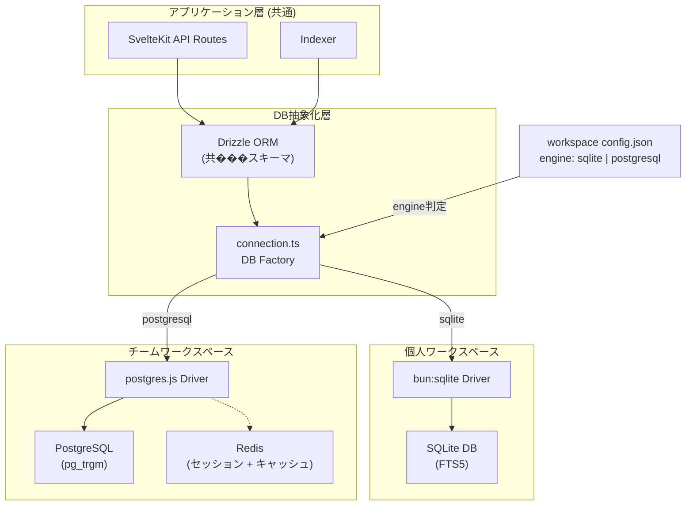

# ADR-007: ワークスペース単位のDBエンジン切替戦略

## 背景・課題 (Background/Problem)
- Prometheusは個人利用（単一ユーザー）とチーム利用（複数ユーザー）の両方をサポートする
- 個人利用では「軽さ」が最優先。外部DBプロセスなしで即座に起動・動作する体験が求められる
- チーム利用では同時書き込み、セッション管理、リアルタイム協調といった要件が加わる
- 単一のDBエンジンではどちらかを犠牲にせざるを得ない
  - SQLiteのみ: 同時書き込み制限��WALモードでも1ライターのみ）がチーム利用のボトルネックになる
  - PostgreSQLのみ: 個人利用で毎回PostgreSQLプロセスを起動する必要があり「軽さ」に反する

## 決定事項 (Decision)
- **ワークスペース単位でDBエンジンを切り替える**
- 個人ワークスペース: **SQLite (bun:sqlite)** — 最速・依存ゼロ・ローカル完結
- チームワークスペース: **PostgreSQL + Redis** — 同時書き込み・セッション管理・キャッシュ
- Drizzle ORMの同一スキーマ・異なるドライバ機能でアプリケーション層を共通化
- ワークスペースの設定ファイル（`config.json`）の`engine`フィールドで切替

### エンジン切替アーキテクチャ



### 各エンジンの役割

| 機能 | SQLite (個人) | PostgreSQL + Redis (チーム) |
|---|---|---|
| ノートインデックス | SQLiteテーブル | PostgreSQLテーブル |
| 全文検索 | FTS5仮想テーブル | pg_trgm + GINインデックス |
| セッション管理 | 不要（認証なし or SQLite��格納） | Redis |
| ノートキャッシュ | 不要（ローカルI/Oが十分高速） | Redis（頻繁にアクセスされるノート） |
| 同時書き込み | WALモード（1ライター制限あり） | MVCC（制限なし） |

### connection.ts の実装方針

```typescript
// 疑似コード
function createDbConnection(workspace: WorkspaceConfig) {
  if (workspace.engine === "sqlite") {
    const sqlite = new Database(getSqlitePath(workspace));
    return drizzle(sqlite, { schema });
  } else {
    const client = postgres(workspace.dbUrl!);
    return drizzle(client, { schema: pgSchema });
  }
}
```

Drizzle ORMはSQLiteとPostgreSQLで**スキーマ定義の型が異なる**（`sqliteTable` vs `pgTable`）。そのため：
- `schema.ts` (SQLite用) と `pg-schema.ts` (PostgreSQL用) の2つを持つ
- テーブル構造は同一だが、型定義ファイルが別
- クエリビルダーのAPI（`db.select()`, `db.insert()`等）は共通のため、アプリケーション層のコードは変更不要
- 全文検索のみエンジン固有��クエリが必要（FTS5 vs pg_trgm）。`SearchService`インターフェースで抽象化

### 理由 (Reasons)
- **個人利用の体験を最大化**: `bun run dev`だけで全て��動く。Docker不要、外部��ロセス不要
- **チーム利用の要件を満たす**: PostgreSQLのMVCCによる同時書き込み、Redisによるセッション管理
- **アプリケーション層のコードが共通**: Drizzle ORMの抽象化により、エンジンの違いを意識��ない開発が可能
- **段階的な構築**: Phase 0-4はSQLiteのみ���開発。PostgreSQL対応はPhase 5で追加。開発の初期段階で不要な複雑性を持ち込まない

### 受け入れるトレードオフ (Accepted Trade-offs)
- **スキーマ定義の二重管理**: SQLite用とPostgreSQL用で別ファイルが必要。テーブル追加時に両方を更新する必要がある
- **全文検索の抽象化コスト**: FTS5とpg_trgmでクエリ構文が異なるため、SearchServiceの実装が2つ必要
- **テスト負荷の増加**: 両エンジンでのテストが必要。ただしCIで並列実行可能
- **PostgreSQL + Redis環境��セットアップ**: チームワークスペースの利用���はdocker-compose等でのインフラ構築が必要

## 検討した別の選択肢 (Alternatives Considered)

### SQLiteのみ（全フェーズ共通）
- **メリット**: シンプル、スキーマ定義が1つ、テストが容易
- **デメリット**: 同時書き込み制限がチーム利用のボトルネック。WALモードでも書き込みは排他的
- **不採用理由**: チーム利用の要件を満たせない

### PostgreSQLのみ（全フェーズ共通）
- **メリット**: 一貫性、スキーマ定義が1つ、同時書き込みに強い
- **デメリット**: 個人利用でもDocker/PostgreSQLの起動が必須。「`bun run dev`で即動く」体験が失われる
- **不採用理由**: 個人利用の軽快さがPrometheusの核心���な価値

### 段階的切替（Phase 0-4はSQLite、Phase 5からPostgreSQLに完全移行）
- **メリット**: スキーマの二重管理が不要（最終的にPostgreSQL一本になる）
- **デメリット**: 個人利用でも常にPostgreSQLが必要に��る
- **不採用理由**: ワークスペース単位の切替の方が、個人・チーム両方のユースケースを最適に満たす

### LibSQL / Turso（分散SQLite）
- **メリット**: SQLiteの互換性を保ちつつ分散対応
- **デメリット**: クラウドサービス依存、セルフホス��版の成熟度、FTS5のサポートが不完全
- **不採用理由**: 現時点ではPostgreSQLの方が安定した選択

## 参考 (References)
- [Drizzle ORM - SQLite](https://orm.drizzle.team/docs/get-started/bun-new#step-2---setup-connection)
- [Drizzle ORM - PostgreSQL](https://orm.drizzle.team/docs/get-started/postgresql-new)
- [SQLite WAL Mode](https://www.sqlite.org/wal.html)
- [PostgreSQL pg_trgm](https://www.postgresql.org/docs/current/pgtrgm.html)
- [Redis as Session Store](https://redis.io/docs/latest/develop/interact/programmability/triggers-and-functions/concepts/session-cache/)

## 議論 (Discussion)
- Drizzle ORMの`sqliteTable`と`pgTable`は型レベルで異なるため、完全な共通スキーマは不可能。ただしテーブル構造（カラム名・型）は統��し、コード生成やテストで整合性を担保する方針
- 全文検索の抽象化について: `SearchService`インターフェースを定義し、`SqliteSearchService`（FTS5）と`PgSearchService`（pg_trgm）を実装する。クエリ構文は異なるが、入力（検��文字列）と出力（ノートID + スコア + スニペット）は統一
- Redisの導入範囲: 当初はセッション管理のみで最小限に始め、パフォーマンス計測の結果に基づいてノートキャッシュを追加���る。過剰なキャッシュは整合性の問題を招くため、計測駆動で判断する
- ワークスペースの`engine`フィールドは作成時に決定し、後から変更しない設計とする。SQLite→PostgreSQLの移行が必要な場合は、エクスポート/インポート機能で対応���.mdファイルが真のソースなので、実質的にはインデックスの再構築のみ）
